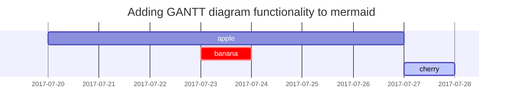

## Headings

<h1 class="mt-5">H1 - heading</h1>

<h2 data-toc-skip>H2 - heading</h2>

<h3 data-toc-skip>H3 - heading</h3>

<h4>H4 - heading</h4>

## Paragraph

Quisque egestas convallis ipsum, ut sollicitudin risus tincidunt a. Maecenas interdum malesuada egestas. Duis consectetur porta risus, sit amet vulputate urna facilisis ac. Phasellus semper dui non purus ultrices sodales. Aliquam ante lorem, ornare a feugiat ac, finibus nec mauris. Vivamus ut tristique nisi. Sed vel leo vulputate, efficitur risus non, posuere mi. Nullam tincidunt bibendum rutrum. Proin commodo ornare sapien. Vivamus interdum diam sed sapien blandit, sit amet aliquam risus mattis. Nullam arcu turpis, mollis quis laoreet at, placerat id nibh. Suspendisse venenatis eros eros.

## Lists

### Ordered list

1. Firstly
2. Secondly
3. Thirdly

### Unordered list

- Chapter
  + Section
    * Paragraph

### ToDo list

- [ ] Job
  + [x] Step 1
  + [x] Step 2
  + [ ] Step 3

### Description list

Sun
: the star around which the earth orbits

Moon
: the natural satellite of the earth, visible by reflected light from the sun

## Block Quote

> This line shows the _block quote_.

## Prompts

> An example showing the `tip` type prompt.
{: .prompt-tip }

> An example showing the `info` type prompt.
{: .prompt-info }

> An example showing the `warning` type prompt.
{: .prompt-warning }

> An example showing the `danger` type prompt.
{: .prompt-danger }

## Tables

| Company                      | Contact          | Country |
|:-----------------------------|:-----------------|--------:|
| Alfreds Futterkiste          | Maria Anders     | Germany |
| Island Trading               | Helen Bennett    | UK      |
| Magazzini Alimentari Riuniti | Giovanni Rovelli | Italy   |

## Links

<http://127.0.0.1:4000>

## Footnote

Click the hook will locate the footnote[^footnote], and here is another footnote[^fn-nth-2].

## Inline code

This is an example of `Inline Code`.

## Filepath

Here is the `/path/to/the/file.extend`{: .filepath}.

## Code blocks

### Common

```
This is a common code snippet, without syntax highlight and line number.
```

### Specific Language

```bash
if [ $? -ne 0 ]; then
  echo "The command was not successful.";
  #do the needful / exit
fi;
```

### Specific filename

```sass
@import
  "colors/light-typography",
  "colors/dark-typography";
```
{: file='_sass/jekyll-theme-chirpy.scss'}

## Mathematics

The mathematics powered by [**MathJax**](https://www.mathjax.org/):

$$ \sum_{n=1}^\infty 1/n^2 = \frac{\pi^2}{6} $$

When $a \ne 0$, there are two solutions to $ax^2 + bx + c = 0$ and they are

$$ x = {-b \pm \sqrt{b^2-4ac} \over 2a} $$

## Mermaid SVG



## Images

### Default (with caption)

{: width="972" height="589" }
_Full screen width and center alignment_

### Linksbündig

{: width="972" height="589" .w-75 .normal}

### links schwebend

{: width="972" height="589" .w-50 .left}
Das links angeordnete Bild bietet eine anschauliche Darstellung des diskutierten Themas. Es veranschaulicht die beschriebenen Konzepte und dient als visueller Ankerpunkt, um die im Text präsentierten Ideen besser zu veranschaulichen. Das Bild ist elegant und subtil platziert, um den Textfluss nicht zu stören und dennoch auf den ersten Blick ins Auge zu fallen. Es hebt wichtige Punkte hervor und bietet gleichzeitig einen ästhetischen Mehrwert für die Seite. Zusammen mit dem Fließtext bietet das Bild eine visuell ansprechende und informativ aufbereitete Seite, die dem Leser hilft, das Thema besser zu verstehen und sich mit den Inhalten zu beschäftigen.

### Float to right

{: width="972" height="589" .w-50 .right}
Auf der rechten Seite des Textes finden Sie ein zusätzliches Bild, das weitere wichtige Aspekte des diskutierten Themas illustriert. Es bietet eine visuelle Unterstützung, um die im Text erläuterten Punkte zu veranschaulichen und zu vertiefen. Sorgfältig rechts platziert, dient es als visuelle Ergänzung, die den Textfluss nicht unterbricht, aber dennoch die Aufmerksamkeit des Lesers auf sich zieht. Durch Hervorheben zentraler Konzepte trägt das Bild zu einem tieferen Verständnis des Themas bei und liefert gleichzeitig einen ästhetischen Mehrwert für die Seite. In Kombination mit dem links platzierten Bild und dem begleitenden Text schafft dieses Bild eine harmonische und ausgewogene visuelle Präsentation. Dies erleichtert dem Leser die Aufnahme und Verarbeitung der Informationen, indem es eine visuell ansprechende und inhaltsreiche Seite bietet, die das Interesse am Thema fördert und hält.

### Dark/Light mode & Shadow

Das Bild unten schaltet den Dunkel-/Hellmodus je nach Designpräferenz um. Beachten Sie, dass es gerundeten Schatten enthält.

{: .light .w-75 .shadow .rounded-10 w='1212' h='668' }
{: .dark .w-75 .shadow .rounded-10 w='1212' h='668' }

## Video



## Reverse Footnote

[^footnote]: The footnote source
[^fn-nth-2]: The 2nd footnote source
