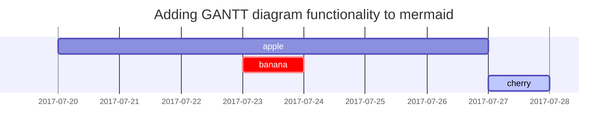

# Gute Typographie 
> ist mehr als nur Ästhetik. Sie ist ein entscheidender Aspekt der effektiven Kommunikation. Durch eine durchdachte Auswahl von Schriftarten, Schriftgrößen, Zeilenabständen und -längen kann eine gute Typographie dazu beitragen, Informationen klarer zu vermitteln, die Lesbarkeit zu verbessern und das allgemeine Benutzererlebnis zu verbessern.

## Überschriften

<h1 class="mt-5">H1 - Überschrift</h1>

<h2 data-toc-skip>H2 - Überschrift</h2>

<h3 data-toc-skip>H3 - Überschrift</h3>

<h4>H4 - Überschrift</h4>

## Paragraphen

Paragraphen sind das Rückgrat eines jeden Textes und spielen eine entscheidende Rolle in der Textstruktur. Sie helfen, Gedanken und Ideen klar zu organisieren und zu präsentieren. Ein gut strukturierter Paragraph enthält in der Regel einen Hauptgedanken, der durch unterstützende Sätze oder Beispiele ergänzt wird. Der erste Satz eines Paragraphen, oft als Leitsatz oder Topic-Satz bezeichnet, gibt den Ton für den restlichen Abschnitt an. Durch sorgfältige Paragraphenstruktur können Autoren ihre Punkte effektiv vermitteln und die Leser durch komplexe Themen führen. Ein guter Paragraph ist nicht nur kohärent und fokussiert, sondern auch ausreichend entwickelt, um den Hauptgedanken vollständig zu behandeln. Er verbessert die Lesbarkeit eines Textes, indem er ihm Struktur gibt und den Lesefluss erleichtert.

> Jeder Paragraph wird im Inhalstverzeichniss Rechts Aufgelistet.
{: .prompt-tip }

## Listen

Listen spielen eine wichtige Rolle in der schriftlichen Kommunikation, indem sie Informationen klar, konsistent und leicht verständlich präsentieren. Sie sind besonders nützlich, wenn mehrere Punkte, Merkmale oder Schritte präsentiert werden müssen. Es gibt zwei Haupttypen von Listen: nummerierte Listen und Aufzählungslisten.

### Geordnete liste

1. Erstens
2. Zweitens
3. Drittens

> Nummerierte Listen werden verwendet, wenn die Reihenfolge der Punkte wichtig ist, wie bei Schritt-für-Schritt-Anleitungen oder Ranglisten. Sie helfen dem Leser, den Verlauf oder die Priorität der Punkte zu verstehen.

### Verschachtelte Liste

- Hauptpunkte
  + Unterpunkte
    * Detailpunkte

> Verschachtelte Listen sind eine effektive Methode, um strukturierte oder hierarchische Informationen darzustellen. In einer verschachtelten Liste repräsentiert jede zusätzliche Verschachtelungsebene eine Unterkategorie oder ein Detail der übergeordneten Ebene. Diese Art der Darstellung ist besonders nützlich für Inhaltsverzeichnisse, Outlines oder jede andere Situation, in der Informationen klar und logisch strukturiert werden müssen.

### ToDo liste

- [ ] Aufgabe 1
- [x] Aufgabe 2
- [ ] Aufgabe 3

> ToDo Listen dienen als visuelle Erinnerung an das, was noch zu erledigen ist, und geben uns ein Gefühl der Zufriedenheit, wenn wir Aufgaben abhaken können. Sie helfen uns, den Überblick zu behalten und die Prokrastination zu reduzieren, indem sie uns auf unsere Ziele und Verpflichtungen fokussieren.

### Verschachtelte ToDo Listen

- [ ] Hauptaufgabe
  + [x] Unteraufgabe 1
  + [ ] Unteraufgabe 2
    * [ ] Detailaufgabe 1
    * [x] Detailaufgabe 2
  + [x] Unteraufgabe 3

> Verschachtelte ToDo-Listen ermöglichen es uns, unsere Aufgaben in überschaubare Teilaufgaben zu unterteilen und so eine klarere Struktur und Priorisierung zu erreichen. Sie visualisieren den Fortschritt auf mehreren Ebenen und erleichtern die Navigation durch komplexe Projekte oder mehrstufige Aufgaben. Die Fähigkeit, Teilaufgaben abzuhaken, während man auf ein größeres Ziel hinarbeitet, kann zusätzliche Befriedigung bieten und die Motivation weiter steigern.

### Beschreibende Listendarstellung

Sun
: the star around which the earth orbits

Moon
: the natural satellite of the earth, visible by reflected light from the sun

## Block-Zitat

> Diese Zeile zeigt den _Block-Zitat_.

## Prompts

> Ein Beispiel für den `tip` Prompt.
{: .prompt-tip }

> Ein Beispiel für einen `info` Prompt.
{: .prompt-info }

> Ein Beispiel für den `warning` Prompt.
{: .prompt-warning }

> Ein Beispiel für einen `danger` Prompt.
{: .prompt-danger }

## Tabelle

Tabellen bieten eine hervorragende Möglichkeit, um zusammengehörige Daten zu präsentieren:

| Unternehmen                  | Kontakt        | Land    |
|:-----------------------------|:-----------------|--------:|
| Alfreds Futterkiste          | Maria Anders     | Deutschland |
| Island Trading               | Helen Bennett    | UK      |
| Magazzini Alimentari Riuniti | Giovanni Rovelli | Italien |

## Link's

Verwenden Sie Links, um auf andere Webseiten oder Ressourcen zu verweisen:

<https://pyt-acadamy.github.io/>

- [PYT-Acadamy](https://pyt-acadamy.github.io/)

- [PYT-Acadamy](https://pyt-acadamy.github.io/){:target="_blank"}

> [PYT-Acadamy](https://pyt-acadamy.github.io/){:target="_blank"}
{: .prompt-tip }

## Fußnote

Fußnoten können verwendet werden, um zusätzliche Informationen oder Quellen zu einem bestimmten Textbereich zu liefern:

Klicke auf den Haken, um die Fußnote zu finden[^footnote], und hier ist die zweite Fußnote[^fn-nth-2].

## Inline-Code

Inline-Code kann verwendet werden, um Code in einem Satz oder Absatz hervorzuheben:

Dies ist ein Beispiel für `Inline Code`.

## Dateipfad

Sie können den Dateipfad-Tag verwenden, um den Pfad zu einer Datei oder einem Ordner hervorzuheben:

Hier ist der `/pfad/zu/der/Dateiname.endung`{: .filepath}.

## Code Blöcke

Codeblöcke sind Abschnitte in Markdown, die zum Hervorheben von Codebeispielen verwendet werden. Sie sind besonders nützlich, wenn Sie Code in einem Textabschnitt einfügen möchten, und sie sorgen dafür, dass der Code ordnungsgemäß formatiert und leicht lesbar ist.

### Common

```
This is a common code snippet, without syntax highlight and line number.
```

### Spezifische Programiersprache

```bash
if [ $? -ne 0 ]; then
  echo "The command was not successful.";
  #do the needful / exit
fi;
```

### Spezifischer Dateiname

```sass
@import
  "colors/light-typography",
  "colors/dark-typography";
```
{: file='_sass/jekyll-theme-chirpy.scss'}

## Mathematische darstellung für Formeln

The mathematics powered by [**MathJax**](https://www.mathjax.org/):

$$ \sum_{n=1}^\infty 1/n^2 = \frac{\pi^2}{6} $$

When $a \ne 0$, there are two solutions to $ax^2 + bx + c = 0$ and they are

$$ x = {-b \pm \sqrt{b^2-4ac} \over 2a} $$

## Mermaid SVG



## Images

### Default (with caption)

{: width="972" height="589" }
_Full screen width and center alignment_

### Linksbündig

{: width="972" height="589" .w-75 .normal}

### links schwebend

{: width="972" height="589" .w-50 .left}
Das links angeordnete Bild bietet eine anschauliche Darstellung des diskutierten Themas. Es veranschaulicht die beschriebenen Konzepte und dient als visueller Ankerpunkt, um die im Text präsentierten Ideen besser zu veranschaulichen. Das Bild ist elegant und subtil platziert, um den Textfluss nicht zu stören und dennoch auf den ersten Blick ins Auge zu fallen. Es hebt wichtige Punkte hervor und bietet gleichzeitig einen ästhetischen Mehrwert für die Seite. Zusammen mit dem Fließtext bietet das Bild eine visuell ansprechende und informativ aufbereitete Seite, die dem Leser hilft, das Thema besser zu verstehen und sich mit den Inhalten zu beschäftigen.

### rechts schwebend

{: width="972" height="589" .w-50 .right}
Auf der rechten Seite des Textes finden Sie ein zusätzliches Bild, das weitere wichtige Aspekte des diskutierten Themas illustriert. Es bietet eine visuelle Unterstützung, um die im Text erläuterten Punkte zu veranschaulichen und zu vertiefen. Sorgfältig rechts platziert, dient es als visuelle Ergänzung, die den Textfluss nicht unterbricht, aber dennoch die Aufmerksamkeit des Lesers auf sich zieht. Durch Hervorheben zentraler Konzepte trägt das Bild zu einem tieferen Verständnis des Themas bei und liefert gleichzeitig einen ästhetischen Mehrwert für die Seite. In Kombination mit dem links platzierten Bild und dem begleitenden Text schafft dieses Bild eine harmonische und ausgewogene visuelle Präsentation. Dies erleichtert dem Leser die Aufnahme und Verarbeitung der Informationen, indem es eine visuell ansprechende und inhaltsreiche Seite bietet, die das Interesse am Thema fördert und hält.

### Dunkel/Hell modus & Schatten

Das Bild unten schaltet den Dunkel-/Hellmodus je nach Designpräferenz um. Beachten Sie, dass es gerundeten Schatten enthält.

{: .light .w-75 .shadow .rounded-10 w='1212' h='668' }
{: .dark .w-75 .shadow .rounded-10 w='1212' h='668' }

## Video



## Reverse Footnote

[^footnote]: The footnote source
[^fn-nth-2]: The 2nd footnote source
